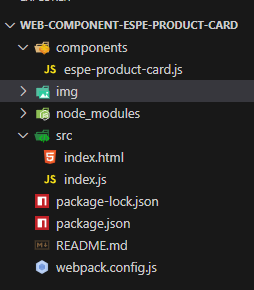
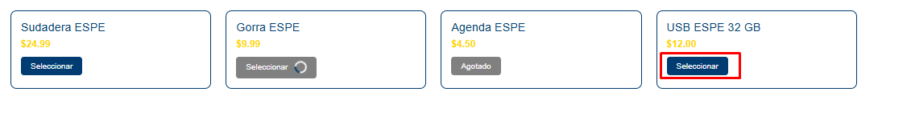
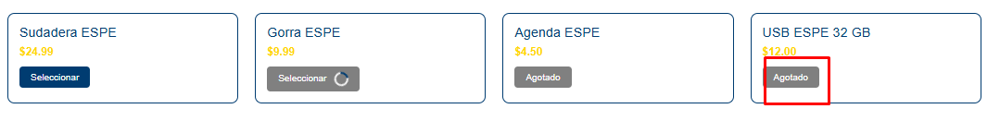
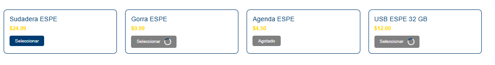
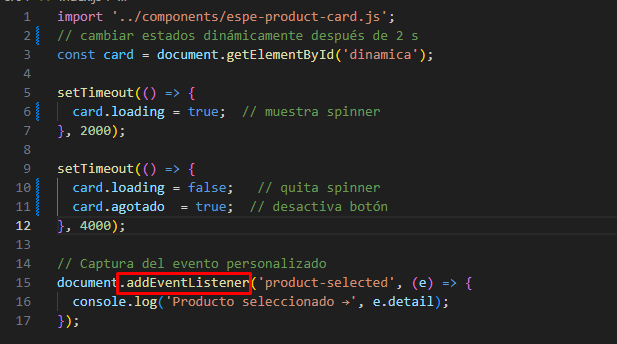
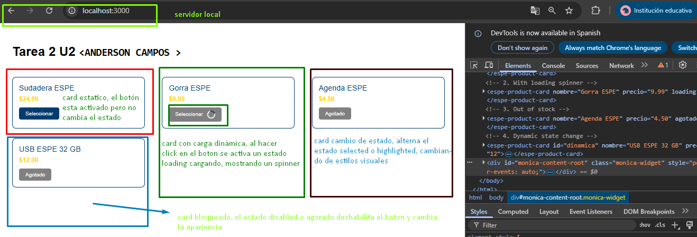

# web-component-espe-product-card

Componente personalizado en LitElement con integración de identidad visual de la ESPE

## <espe-product-card> – Componente Web con LitElement

### Objetivo

Personalizar el comportamiento de un Web Componente usando **LitElement**, integrando:

- Estados dinámicos usando `@property` para manejar atributos reactivos.
- Temas y estilos alineados al Manual de Imagen de la ESPE (colores institucionales y tipografía).
- Eventos personalizados para la comunicación entre componentes.
- Buenas prácticas de desarrollo priorizando la originalidad, sin código generado por IA.
---

## Estructura del Proyecto 
-  components/ bien usada.
- Archivos bien organizados **(index.html, index.js, webpack.config.js, package.json).** 
- Uso de **Webpack** y **html-webpack-plugin**.
- Componente definido y registrado con customElements.define. 



## Uso de @property para manejar estados dinámicos 
Se uso el property para definir: 
para definir:
- ATRIBUTOS -->    TIPO    -->   DESCRIPCIÓN
- nombre    --> `String`   -->   Nombre del producto. 
- precio    --> `String`   -->   Precio mostrado.
- loading   --> `Boolean`  -->   Si está activo, muestra un spinner y desactiva el botón. 
- agotado   --> `Boolean`  -->   Si está activo, cambia el botón a "Agotado" y lo desactiva. 

## Ejecución 
Si está activo, cambia el botón a "Agotado"



cambio realizado en dos segundos 



Si está activo, muestra un spinner y desactiva el botón. 



---
> Debido a problemas de compatibilidad con `.babelrc`, se utilizó `static get properties()` en lugar del decorador `@property`. Esta alternativa es válida y compatible con versiones previas de LitElement.
---

Esto permite que los atributos cambien dinámicamente desde el HTML o JavaScript, y eso se refleja en el renderizado del componente. Además, usas setTimeout para simular cambios de estado en el producto USB, lo cual muestra dominio de reactividad con LitElement. 

## Estilos alineados al Manual de Imagen de la ESPE
Colores oficiales: Usaste #003C71 (azul) y #FFD700 (dorado).

Tipografía: Arial, como se pide.

Espaciado y diseño claro: Usaste padding, gap, border-radius y un layout de tarjetas responsive. 
###  CSS:
```css
/* Código CSS aquí */
:host {
  display: block;
  font-family: Arial, sans-serif;
  border: 2px solid #003C71;
  border-radius: 10px;
  padding: 16px;
  max-width: 300px;
  background-color: white;
}
 .nombre {
      font-size: 1.2em;
      color: #003C71;
      margin-bottom: 8px;
    } 
```
## Eventos personalizados para comunicación 

Se implemento **dispatchEvent** con un evento **product-selected** que notifica cuando se hace clic en el botón.

Esto demuestra comunicación intercomponente usando el modelo de eventos nativo del DOM. Excelente.



## Validación y Accesibilidad 

Usas aria-label en el botón e incluyes tabindex="0" y role="button" para accesibilidad con teclado.

## Ejemplos de Uso

### 1. Tarjeta estándar
```html
<espe-product-card
  nombre="Sudadera ESPE"
  precio="24.99">
</espe-product-card> 
```
Tarjeta activa con botón “Seleccionar”.

### 2. Tarjeta con carga (loading)
```html
<espe-product-card
  nombre="Gorra ESPE"
  precio="9.99"
  loading>
</espe-product-card>
```
Muestra spinner, botón deshabilitado temporalmente.

### 3. Tarjeta agotada
```html
<espe-product-card
  nombre="Agenda ESPE"
  precio="4.50"
  agotado>
</espe-product-card>
```
Botón deshabilitado con mensaje “Agotado”. 

### 4. Tarjeta con estado dinámico desde JS
```html
<espe-product-card
  id="dinamica"
  nombre="USB ESPE 32 GB"
  precio="12">
</espe-product-card>
```

```js
const card = document.getElementById('dinamica');

setTimeout(() => {
  card.loading = true;
}, 2000);

setTimeout(() => {
  card.loading = false;
  card.agotado  = true;
}, 4000);
``` 

Cambia de estado automáticamente (loading → agotado).

## Eventos Personalizados
El componente emite un evento **product-selected** cuando se hace clic en el botón de selección:

```js 
document.addEventListener('product-selected', (e) => {
  console.log('Producto seleccionado →', e.detail);
});
``` 
El evento incluye en su detail:
`nombre`
`precio`
Esto permite comunicación con otros componentes o sistemas que escuchen el evento. 

## ¿Dónde y por qué se usó static get properties()? 

Dentro de tu componente EspeProductCard, el bloque:

```js 
static get properties() {
    return {
      nombre: { type: String },
      precio: { type: Number },
      loading: { type: Boolean },
      agotado: { type: Boolean }
    };
  }
```
### Aquí se definen 4 propiedades que el componente observa:

- nombre: El nombre del producto. Cuando cambia, se actualiza automáticamente el render.
- precio: Valor numérico. Se muestra con dos decimales.
- loading: Booleano. Si es true, muestra un spinner y desactiva el botón.
- agotado: Booleano. Si es true, el botón se desactiva y muestra el texto "Agotado".

LitElement detecta cambios en estas propiedades y actualiza el DOM automáticamente sin que tú lo hagas manualmente. 

### ¿Qué hace y por qué se usó?

Esta es la forma tradicional de definir propiedades reactivas en LitElement.
Se usó static get properties() porque no se configuró Babel para permitir decoradores como @property los decoradores (@property) requieren:

- Babel o TypeScript con configuración especial.
- Un archivo .babelrc y plugins como @babel/plugin-proposal-decorators.

Como en esta práctica no se implementó Babel por simplicidad o compatibilidad, se eligió static get properties() que es 100% válido y funcional en JavaScript puro sin compilación.

salian una gran variedad de errores de compatibilidad. 

### ¿Es lo mismo que @property?
Sí, funcionalmente hacen lo mismo:
- Reactividad
- Soporte a atributos HTML
- Actualización automática del render()

La diferencia es la forma de escribirlo: 

```js 
// Requiere Babel/configuración
@property({ type: String }) nombre = 'Producto';
```
```js 
// Funciona sin herramientas adicionales
static get properties() {
  return {
    nombre: { type: String }
  };
}
```
## Conexión con el resto del código

Estas propiedades están conectadas con el método render() que se encuentra en nuestro componente:

```js 
<button 
  ?disabled=${this.agotado || this.loading}
  @click=${this.handleClick}>
  ${this.agotado ? 'Agotado' : 'Seleccionar'}
  ${this.loading ? html`<span class="spinner"></span>` : ''}
</button>

```

## Ventajas de LitElement 

- Reactividad automática con propiedades.

- Encapsulamiento completo mediante Shadow DOM.

- Plantillas declarativas con html para un código más limpio.

- Integración moderna con Webpack, Vite, etc.

# Ejecución desde consola 
```bash
npm run serve
```
Abre tu navegador por lo general con el siguiente link:

```bash
http://localhost:3000 
```


## Conclusión 

- En esta actividad se demostro el uso profesional de LitElement para construir componentes reutilizables con estados dinámicos, diseño institucional, y buena integración con herramientas modernas.

- El uso de static get properties() en lugar de @property fue una decisión técnica consciente por problemas de compatibilidad con .babelrc. Esta elección garantiza que el componente funcione sin necesidad de compiladores adicionales como Babel, manteniendo la simplicidad y compatibilidad con navegadores modernos.

- LitElement facilita la creación de componentes web reutilizables y modernos, gracias a su enfoque basado en propiedades reactivas, plantillas declarativas y estilos encapsulados mediante Shadow DOM.